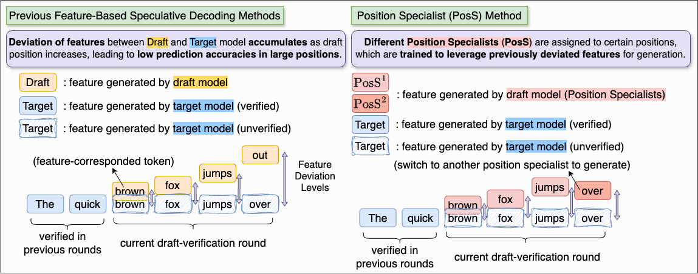
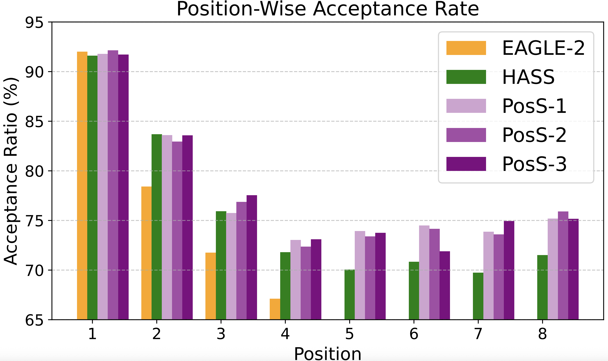

# PosS:Position Specialist Generates Better Draft for Speculative Decoding
> **Authors: [Langlin Huang](https://shrango.github.io/), [Chengsong Huang](https://chengsong-huang.github.io/), [Jixuan Leng](https://jixuanleng.com/), Di Huang, [Jiaxin Huang](https://teapot123.github.io/)**

<!-- Introduction of our work -->
## PosS
Feature-based speculative decoding use features from previous steps as input to generate better draft tokens. The draft-generated features deviate from features which will be given by target model. Such deviation accumulates as draft position increases, because the deviated feature becomes input when drafting the next position.

**PosS** proposes several Position Specialists, which are responsible for drafting certain positions. They are trained to generate high-quality draft tokens with certain previous deviated features as inputs. During inference time, these Positions Specialists mitigate feature deviations and make accurate predictions even at large positions.


**PosS** achieves higher **position-wise acceptance rate** *(acceptance rate at a position given its previous positions are accepted)* than previous methods:
<div align="center">

</div>

**Table of Content**
1. [Environment Set-up](#environment-set-up)
2. [Evaluation](#evaluation-with-trained-models)
3. [Training](#training)
4. [Citation](#citation)

## Environment Set-up
Please use the following command to install the environment depndencies:
```
pip install -r requirements.txt
```

## Evaluation with Trained Models
### Inference
To evaluate all methods we mention in our paper, please use the file `spec_decode.py`.

Here is an example of evaluation:

```bash
python spec_decode.py \
    --device-num 0 \
    --target-model llama3-8b \
    --method poss-3 \
    --temperature 0 \
    --total-token 60 \
    --depth 6 \
    --repeat-time 3 \
    --dataset mt_bench
```

| Argument         | Description                                                                 |
|------------------|-----------------------------------------------------------------------------|
| `--device-num`   | CUDA device number                                                          |
| `--target-model` | The name of the target model, choosing from `{"llama3-8b", "llama2-13b"}`   |
| `--method`       | The method name of draft model, choosing from `{"eagle", "hass", "poss-1", "poss-2", "poss-3"}` |
| `--temperature`  | Generation temperature                                                      |
| `--total-token`  | The number of tokens to verify at each draft-verification round            |
| `--depth`        | The number of positions to draft at each draft-verification round          |
| `--repeat-time`  | Run the inference with the same setting for several times to get a more reliable result |
| `--dataset`      | The test set, choosing from `{"mt_bench", "alpaca", "gsm8k", "humaneval", "qa", "sum"}`<br>`qa` stands for "Natural Questions", and `sum` stands for "CNN/DM" summarization |

### PosS Weights
We also provide our trained parameters in Huggingface:
|Base Model|PosS-1 Weights|PosS-2 Weights|PosS-3 Weights|
|:---:|:---:|:---:|:---:|
|Llama3-8B-Instruct|[HINT-lab/PosS1-Llama3-8B-Instruct](https://huggingface.co/HINT-lab/PosS1-Llama3-8B-Instruct)|[HINT-lab/PosS2-Llama3-8B-Instruct](https://huggingface.co/HINT-lab/PosS2-Llama3-8B-Instruct)|[HINT-lab/PosS3-Llama3-8B-Instruct](https://huggingface.co/HINT-lab/PosS3-Llama3-8B-Instruct)|
|Llama2-13B-Chat|[HINT-lab/PosS1-Llama2-13B-Chat](https://huggingface.co/HINT-lab/PosS1-Llama2-13B-Chat)|[HINT-lab/PosS2-Llama2-13B-Chat](https://huggingface.co/HINT-lab/PosS2-Llama2-13B-Chat)|[HINT-lab/PosS3-Llama2-13B-Chat](https://huggingface.co/HINT-lab/PosS3-Llama2-13B-Chat)|

### Evaluation Metrics
#### Acceptance Length
Use this command to evaluate the acceptance length:
```
python evaluation/acceptance_length.py --my_model_json [path of output json]
```

#### Throughput
Use this command to evaluate the throughput:
```
python evaluation/throughput.py --my_model_json [path of output json]
```

You can calculate the speed-up ratio using the throughputs.

## Training
### Generate Training Data
We use ShareGPT data for model training, please download it to prepare for training data generation.
```
cd ge_data
wget https://huggingface.co/datasets/Aeala/ShareGPT_Vicuna_unfiltered/resolve/main/ShareGPT_V4.3_unfiltered_cleaned_split.json
```

Then, run the commands to generate the training data.

* Llama-2-13B-Chat:
```
python -m ge_data.allocation --base_model "llama2" --model_path "meta-llama/Llama-2-13b-chat-hf" --data_path "ge_data/ShareGPT_V4.3_unfiltered_cleaned_split.json" --outdir [path of data]
```
* Llama-3-8B-Instruct:
```
python -m ge_data.allocation --base_model "llama3" --model_path "meta-llama/Meta-Llama-3-8B-Instruct" --data_path "ge_data/ShareGPT_V4.3_unfiltered_cleaned_split.json" --outdir [path of data]
```

### Train PosS Model
```
accelerate launch -m --mixed_precision=bf16 train.main_poss --tmpdir [path of data] --cpdir [path to save checkpoints] --configpath [path of config] --forward_num_total [training depth] --position_per_layer [positions per specialist]
```

You can also use the training script demo `train_poss.sh` for training.

### Evaluation of the Customized Model
The following command provides a template for evalution:
```
CUDA_VISIBLE_DEVICES=0 python -m evaluation.gen_poss_answer_llama3chat (or evaluation.gen_poss_answer_llama2chat) \
    --ea-model-path ${DraftPath} \
    --base-model-path ${TargetPath} \
    --temperature 0 \
    --model-id ${base_model}-${method_name}-depth${DEPTH}-tt60-iter${iter} \
    --forward_num_total 6 (align with your training setting) \
    --position_per_layer 3 (align with your training setting) \
    --bench-name ${DATASET} \
    --total-token 60 \
    --depth ${DEPTH}
```

## Citation