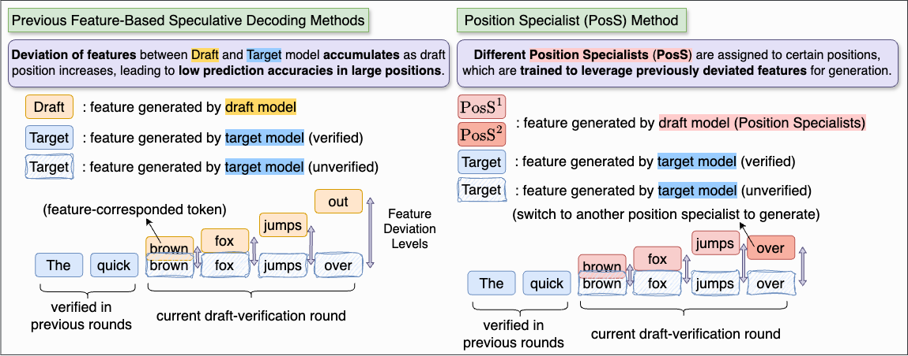
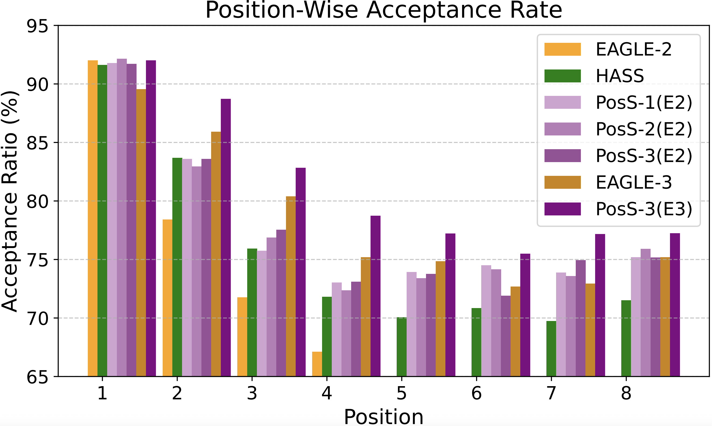

# SPEED: Specialized Position Experts for Efficient Speculative Decoding
> **Authors: [Langlin Huang](https://shrango.github.io/), [Chengsong Huang](https://chengsong-huang.github.io/), [Jixuan Leng](https://jixuanleng.com/), Di Huang, [Jiaxin Huang](https://teapot123.github.io/)**

[](https://arxiv.org/abs/2506.03566)
[](https://github.com/shrango/PosS)
[](https://huggingface.co/collections/HINT-lab/poss-speculative-decoding-68376c8e7aa6a0fe23dc2116)
<!-- Introduction of our work -->
## SPEED
Feature-based speculative decoding uses features from previous steps as input to generate better draft tokens. The draft-generated features deviate from features that will be given by the target model. Such deviation accumulates as the draft position increases, because the deviated feature becomes input when drafting the next position.

**SPEED** (also named as **PosS** in the previous version) proposes several Specialised Position Experts, which are responsible for drafting certain positions. They are trained to generate high-quality draft tokens with certain previously deviated features as inputs. During inference time, these Position Specialists mitigate feature deviations and make accurate predictions even at large positions.


**SPEED** achieves higher **position-wise acceptance rate** *(acceptance rate at a position given its previous positions are accepted)* than previous methods:
<div align="center">

</div>

SPEED(E2) means it applies EAGLE-2 structure as the backbone, and SPEED(E3) means it applies EAGLE-3 structure as the backbone.

**Table of Contents**
1. [Environment Set-up](#environment-set-up)
2. [Evaluation](#evaluation-with-trained-models)
3. [Training](#training)
4. [Citation](#citation)

## Environment Set-up
Please use the following command to install the environment dependencies:
```
pip install -r requirements.txt
```

## Evaluation with Trained Models
### Inference
To evaluate all methods we mention in our paper, please use the file `spec_decode.py`.

Here is an example of evaluation:

```bash
python spec_decode.py \
    --device-num 0 \
    --target-model llama3-8b \
    --method poss-3 \
    --temperature 0 \
    --total-token 60 \
    --depth 6 \
    --repeat-time 3 \
    --dataset mt_bench
```

| Argument         | Description                                                                 |
|------------------|-----------------------------------------------------------------------------|
| `--device-num`   | CUDA device number                                                          |
| `--target-model` | The name of the target model, choosing from `{"llama3-8b", "llama2-13b"}`   |
| `--method`       | The method name of draft model, choosing from `{"baseline", "eagle", "hass", "poss-1", "poss-2", "poss-3"}`, where `"baseline"` means not using speculative decoding |
| `--temperature`  | Generation temperature                                                      |
| `--total-token`  | The number of tokens to verify at each draft-verification round            |
| `--depth`        | The number of positions to draft at each draft-verification round          |
| `--repeat-time`  | Run the inference with the same setting for several times to get a more reliable result |
| `--dataset`      | The test set, choosing from `{"mt_bench", "alpaca", "gsm8k", "humaneval", "qa", "sum"}`<br>`qa` stands for "Natural Questions", and `sum` stands for "CNN/DM" summarization |

### SPEED Weights
We also provide our trained parameters on Huggingface:
|Base Model|SPEED-1 Weights|SPEED-2 Weights|SPEED-3 Weights|
|:---:|:---:|:---:|:---:|
|Llama3-8B-Instruct|[HINT-lab/PosS1-Llama3-8B-Instruct](https://huggingface.co/HINT-lab/PosS1-Llama3-8B-Instruct)|[HINT-lab/PosS2-Llama3-8B-Instruct](https://huggingface.co/HINT-lab/PosS2-Llama3-8B-Instruct)|[HINT-lab/PosS3-Llama3-8B-Instruct](https://huggingface.co/HINT-lab/PosS3-Llama3-8B-Instruct)|
|Llama2-13B-Chat|[HINT-lab/PosS1-Llama2-13B-Chat](https://huggingface.co/HINT-lab/PosS1-Llama2-13B-Chat)|[HINT-lab/PosS2-Llama2-13B-Chat](https://huggingface.co/HINT-lab/PosS2-Llama2-13B-Chat)|[HINT-lab/PosS3-Llama2-13B-Chat](https://huggingface.co/HINT-lab/PosS3-Llama2-13B-Chat)|

#### ⚠️ **Update**:

SPEED with EALGE-3 structure: [HINT-lab/PosS3-E3-Llama3.1-8B-Instruct](https://huggingface.co/HINT-lab/PosS3-E3-Llama3.1-8B-Instruct)


### Evaluation Metrics
#### Acceptance Length
Use this command to evaluate the acceptance length:
```
python evaluation/acceptance_length.py --my_model_json [path of output json]
```

#### Throughput
Use this command to evaluate the throughput:
```
python evaluation/throughput.py --my_model_json [path of output json]
```

You can calculate the speed-up ratio using the throughput ratio of the evaluated method with the *baseline*.

## Training
### Generate Training Data
We use ShareGPT data for model training; please download it to prepare for training data generation.
```
cd ge_data
wget https://huggingface.co/datasets/Aeala/ShareGPT_Vicuna_unfiltered/resolve/main/ShareGPT_V4.3_unfiltered_cleaned_split.json
```

Then, run the commands to generate the training data.

* Llama-2-13B-Chat:
```
python -m ge_data.allocation --base_model "llama2" --model_path "meta-llama/Llama-2-13b-chat-hf" --data_path "ge_data/ShareGPT_V4.3_unfiltered_cleaned_split.json" --outdir [path of data]
```
* Llama-3-8B-Instruct:
```
python -m ge_data.allocation --base_model "llama3" --model_path "meta-llama/Meta-Llama-3-8B-Instruct" --data_path "ge_data/ShareGPT_V4.3_unfiltered_cleaned_split.json" --outdir [path of data]
```

### Train SPEED Model
```
accelerate launch -m --mixed_precision=bf16 train.main_poss --tmpdir [path of data] --cpdir [path to save checkpoints] --configpath [path of config] --forward_num_total [training depth] --position_per_layer [positions per specialist]
```

You can also use the training script demo `train_poss.sh` for training.

### Evaluation of the Customized Model
The following command provides a template for evaluation:
```
CUDA_VISIBLE_DEVICES=0 python -m evaluation.gen_poss_answer_llama3chat (or evaluation.gen_poss_answer_llama2chat) \
    --ea-model-path ${DraftPath} \
    --base-model-path ${TargetPath} \
    --temperature 0 \
    --model-id ${base_model}-${method_name}-depth${DEPTH}-tt60-iter${iter} \
    --forward_num_total 6 (align with your training setting) \
    --position_per_layer 3 (align with your training setting) \
    --bench-name ${DATASET} \
    --total-token 60 \
    --depth ${DEPTH}
```
### ⚠️ **Update**:

We now support training SPEED(E3) with SpecForge and evaluating SPEED(E3) with vLLM.

#### Training with SpecForge

Enter the SpecForge folder `cd specforge` and run the script `bash run_llama3.1_poss_eagle3_online_mix_data.sh`.

#### Evaluation with vLLM

Enter the vLLM folder `cd vllm` and run the script `bash eval-poss.sh`.

For standard generation, please run `bash eval-base.sh`.

For EAGLE-3 baseline, please run `bash eval-eagle3.sh`

## Citation
If you find this work useful, please cite as:
```
@inproceedings{
huang2026speed,
title={{SPEED}: Specialized Position Experts for Efficient Speculative Decoding},
author={Langlin Huang and Chengsong Huang and Jixuan Leng and Di Huang and Jiaxin Huang},
booktitle={Third Conference on Language Modeling},
year={2026},
url={https://openreview.net/forum?id=ugRJVwcjbZ}
}
```

Note: This repository includes modified code adapted from vLLM (Apache-2.0).
